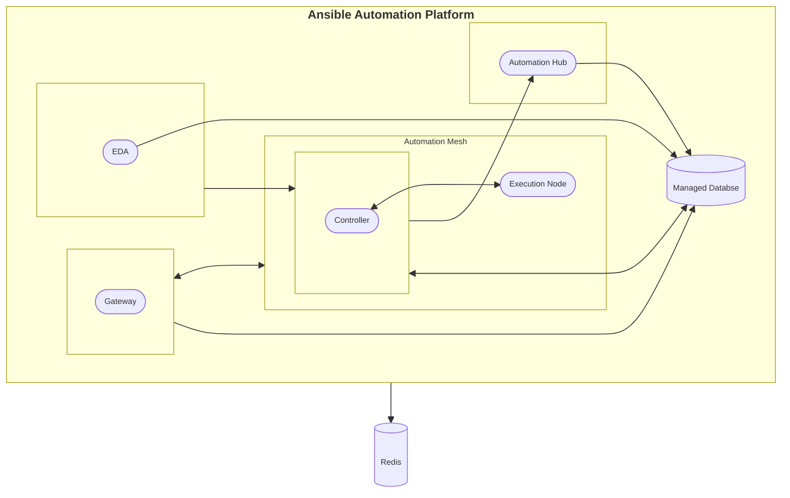
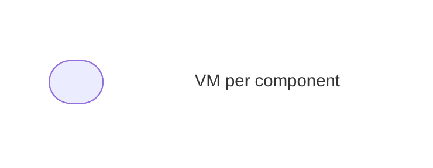

# Single VM installer per AAP Component RPM A

## Topology



**_Legend:_**



## Description

The **Single VM installer per AAP Component RPM A** consists of the following:

| Component | VM count |
| --- | ----------- |
| AAP Gateway | 1 |
| Automation Controller | 1 |
| Hop Node | 1 |
| Automation Hub | 1 |
| Event Driven Ansible | 1 |
| Database (external) | 1 |
| Redis Cache (non-HA) | 1 |

## Inventory

```
```
